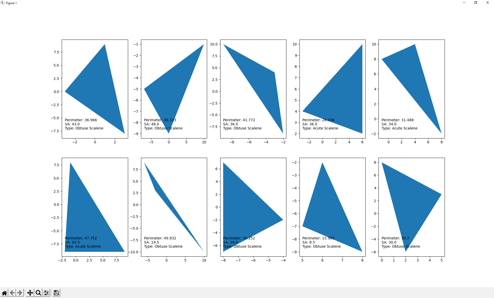

# triangle
## Description
Plots a series of triangles from points, along with their area, perimeter, and type:

## Input
The script reads the points from a CSV file, being a convinient and straight-forward format for the user, and will be faster than manually inputting these values.